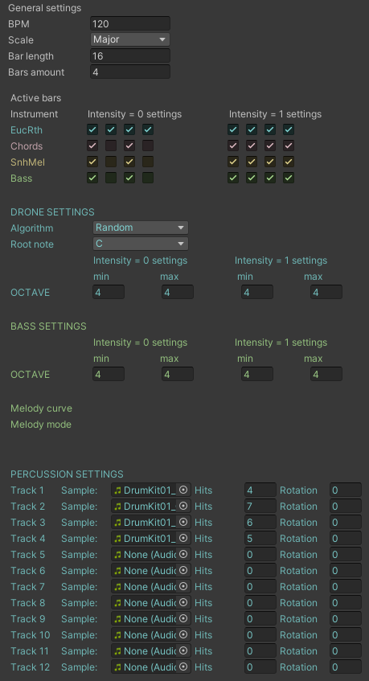

**Mapping things out**

The idea was to use height differences to maximize the distance between areas while keeping the footprint small. Further, I hope to create a sense of scale and make the map appear larger than it actually is.

I spent a lot of time looking at this configuration interface for the music system:

Above snapshot shows the configuration at the time I created this entry. Below is how it looked like when I uploaded this entry.

**Climbing notes**

I renamed the Arpeggiator. The generation of rhythm and melody is currently separate from each other. All the (now aptly named) climber does is selecting the note pitches by climbing a musical scale up or down, whereas an arpeggiator is typically also responsible for the repetition of the notes themselves, which is currently completely handled by setting the respective Euclidean rhythm parameters.

**A hard reset followed by an epiphany**

Wednesday, February 14, 20:55. As my Cheetos-stained fingers type these words, I finally got a sense of direction for this project. My original plan for today was to test a build of the project because I was curious if the audio system I was using would actually work. I was very sure that it would, at least as a Windows build in the worst case. To my surprise, that was not the case, meaning that most of the implementation work of the past weeks could've been or should've been avoided.
Enter again, Unreal. I had originally planned to use it for this project but didn't feel confident enough to work with it on a new, time-constrained project. However, after I had already "practiced" using Unreal for a few months, the switch was surprisingly easy. I was able to whip up a basic set up that would resemble what I already had in Unity, music and all, and then some.

except for the sound all the none of that I could use an unreal however, I since I just opened the original Soundgarden project which was created in unreal I could use what I had already made a few weeks back all the modules that I use will, of course, a part of my documentation so to get a basic sea running up that has a piece some resemblance to my outlined concept, I created sound objects that would be symbols for certain areas on the map. Originally, the unity map had a swamp in it turned into a sea Cove since our real since this ended up, easier to set up another swamp scene there was a hill and a beach i put these together a standalone sound unit and they all follow the same structure using Realtime generator sound,

My concept for sound objects is to combine two sound layers: The first layer would aim to emulate a naturally occurring sound, for example, using noise to generate something that represents waves, or wind. The second layer would present a melodic sound. Sound objects can be connected to a global sequencer that controls both diegetic and non-diegetic music/sounds. Harmonic sound layers could be harmonically linked to an overall musical scale, and any time-based aspects could be synchronized with global music tempo and rhythm.
Now comes the epiphany: Since the beginning of the project, I was struggling with controlling the overall musical outcome. My approach was to have music configurations, i.e., sets of parameters, that would define how music would be generated in each area of the game world. This proved to be difficult, since there are **many** of parameters. Also, I'm not familiar with Unreal's GUI building tools enough to implement a complex UI. The solution? Influence individual generative music parameters, rather than whole configurations. This would also be compatible with my approach of 

I had after I have put together the basic setup. I realize it will be much easier to have one jam of music set up rather than specific instrument setups per area. In the case of the Soundgarden, have these are specific components be represented by the symbolic sounds that would allow me to extremely simplify my approach since I don't have to come up with the general solutions for everything, but can use many independent units and just connect them with more straightforward connections like having pitch controlled or having the number of occurrences of a sound controlled by a global tempo. Then, if I have all that, I can go and manipulate these global parameters to make use of the music emotion research aspect. So there, I could see how I could so in these global aspects, I could integrate modification musical of ruth Mc unit modification of Pitch and timber and because then I don't have to deal with finding configurations for each instrument per music zone but rather I can just one configuration, and one set of techniques, and this will be the basic sound player that will connect all the sound objects and to be supporting the gameplay. Doing this, I can also avoid having to set up an extensive user interface for configuring the sound. I can do everything within the. The thing about this approach is also, in my opinion, it gets closer to actual music for me. Using Meadow sounds is like using a modular, and I'm really system certainly can certainly be a very expressive and performing instrument. I will provide an example.

...However, certain technical optimizations, such as creating individual patches for every function make real-time manipulation of parameters far less immediate than using a real modular synthesizer. Nevertheless, there is still enough level of immediacy to allow for moments of listening to the subtleties of the sounds and finely tweaking parameters to find the most interesting and fitting ones.

Planning out a test pattern in FL Studio.

