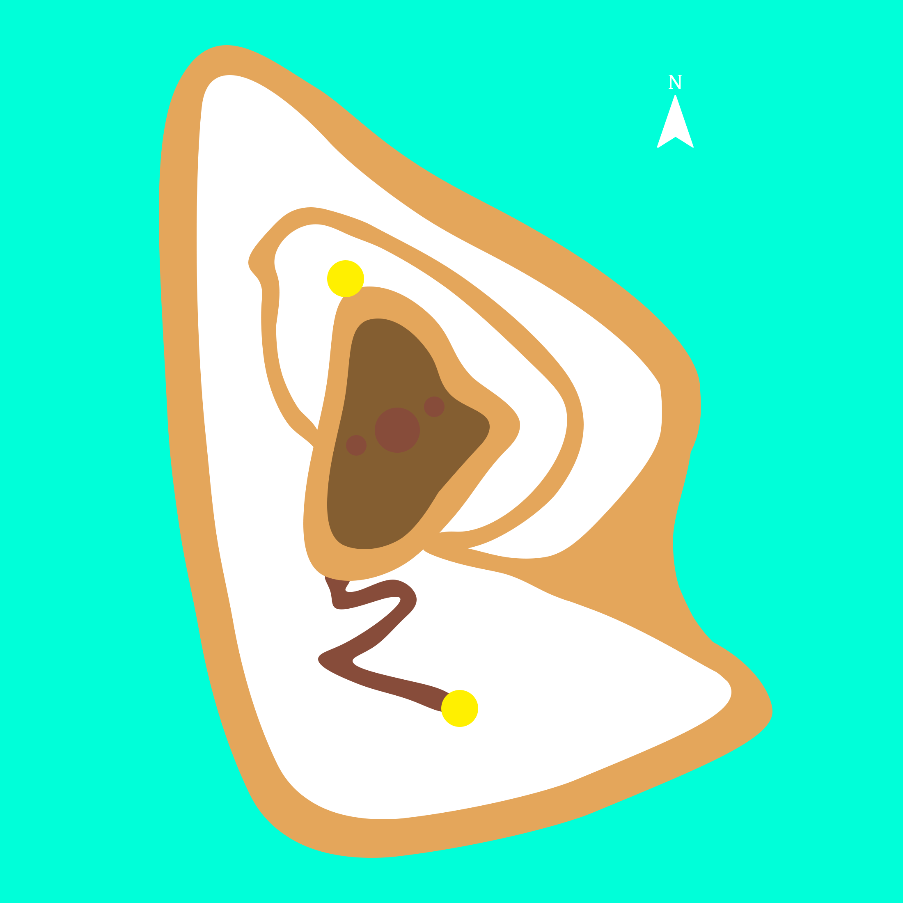
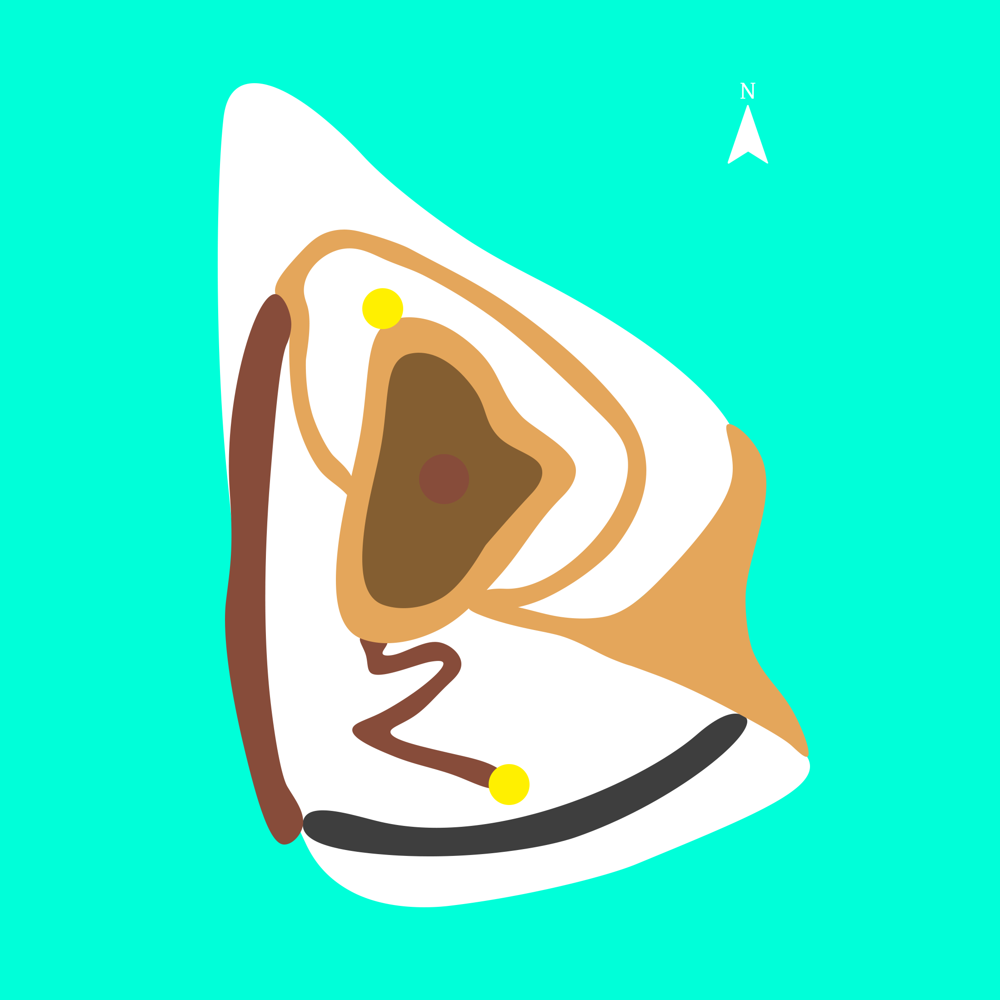

[Back to main](index.html)

**Ch-ch-ch-ch-changes (and additions)** ➕

Below is the original layout of the island that I created when I switched to Unreal.

In this version, the island is encircled by a beach, which the player is able to walk on, giving them the possibility to walk all around the island. Collectibles can spawn here as well, which turned out to be a bit of an issue: While the elevated ring path around the swamp and the hillside outlook (southern yellow circle) allow the player to overlook the eastern, northern, and northwestern parts of the beach, this is not the case for the southern and southwestern parts. Furthermore, if the player wanted to get to an elevated position to look for the next collectible, there is only one access point to the inner part of the island, which is at the intersection between the beach, elevated path, and swamp. Testing the game, I realized this led a lot of walking, especially when circling the island via the beach, only to find the next collectible elsewhere.

Addressing these issues, I massively reduced the size of the beach, with only a relatively small patch left in the east of the island. I then added two new areas in the south and west that connect the beach to the elevated pathway. The new area in the south is a cave that can be accessed from the beach and leads to the new area in the west, a rocky path along the ocean.

I also chose to add a cave as a type of environment because it contrasts the outdoor areas. A cave provides opportunity to implement a noticeable reverb, affecting sounds and music. I have also scattered colorful lights around it that I plan to synchronize with the music. I'm also thinking about an unlockable event where paintings appear on the cave walls, depicting the progression and pitch of an audible melody.

The cave leads to a rocky path along the ocean, which leads back to the elevated pathway around the swamp. These changes in the map layout allow the player to reach other parts of the island quicker and reduce overall walking. When it comes to finding the collectibles, the cave and the southern part of the new ocean path cannot be seen from the hillside outlook. However, since these are the only areas that can't be seen from the outlook, the player should be able to deduce that the next collectible is likely in one of these areas.

This new and improved map layout facilitates movement much better than before: The hillside outlook is intended as a point of rest and reflection, facilitated by the fact that it's a dead end, even though the cries of the parrots during daytime might get annoying after a while. All other paths eventually circle back to themselves. The player can essentially walk in several circles, never stopping on their way to find the collectibles.

Apart from changes to the map, I have also added a light orb which appears above the player when it's dark outside, illuminating the way. The orb follows the player with a slight delay. This means that whenever the player is moving, the area in front of them is not as bright as when the player is static and the orb is above them. The reasoning behind this delay is that the diminished lighting during movement may help find the collectibles in the distance better, since they are always slightly lit up, which could be missed if the player's immediate surroundings are too bright. On the other hand, standing still with full brightness above allows players to see their immediate environment clearly if they want to focus on it.

Furthermore, I have added some fireflies to the swamp area, which appear when it's dark. In addition, I have begun to add some 'filler' sounds in various areas of the map, to make the soundscape sound more lush overall. These sounds are generally less involved in terms of implementation, and rely more strongly on playing back samples without some procedural logic behind it. Some sounds are audible to different degrees, based on other factors, such as sun brightness (similar to the animal sounds).

**Playing with acoustics** 👂

I added the Microsoft Acoustics plugin to the project. This plugin is essentially the equivalent of a light baking solution, only for audio. It simulates the real-world behavior of soundwaves traveling through space, including occlusion, attenuation, sounds reverberation and bouncing off of surfaces. I hoped this would simplify remove the need to set all these parameters by hand, while providing a realistic and much higher fidelity spatial audio. On the downside, baking a scene for acoustics takes much longer than baking lighting. I performed one bake which took three days on my desktop PC. Unfortunately, the results were underwhelming, with no discernible reverberation and errors in sound occlusion. I could've fixed these issues by preparing the bake better, however, I didn't want to risk losing any more time on this.

Using MS Acoustics could've especially been cool with added microphone support: Imagine the player walking through the environment, speaking into the microphone, their voice reverberating through the environment in physically accurate ways. It would sure have added to the aspect of player embodiment!

Once the academic deadline for this project has passed, I might return to this. Until then, I will fake sound propagation using the usual engine tools, creating custom attenuation curves, setting up occlusion, and using impulse response-based reverberation. Impulse responses from real-world environments can be used to simulate the  reverberation characteristics of real-world environments. By taking impulse responses from real environments that resemble the individual areas of the island, I can at least create some sense of how sounds would travel were this a real place.

**Footsteps...and more?** 👣

On the topic of player embodiment, I have implemented a system for footsteps, including support for different surface materials. While the system itself works, I'm still having trouble dealing with the intricacies of UE5, as I'm still learning. Therefore, the footsteps don't work properly yet, however, I'm confident it will all be fine by the time I submit this project in two weeks.

Anyway, unlike what I have often seen in other game projects, I'm using two audio sources for the footsteps instead of one - one for each foot. This way, each step sound would come either slightly from the bottom left or right of the player. In situations where the player might be walking on the edge between multiple surfaces - for example, one foot might step onto sand, and another foot would step onto water - this would likely better reflect the player's immediate environment.

I was also thinking about expanding this approach to other body parts, thinking about shoulders, arms, or hips brushing against close surfaces, for example, when crawling through foliage, or squeezing through a narrow opening. I don't plan to implement this immediately but I'd certainly like to experiment with this sometime in the future!

**A few more steps** ⚒️

- Add more things that happen when the player collects stones
- Add a musical stinger whenever the player collects a stone. It could change, according to how many stones the player has already collected
- Move more musical elements into the diegetic space
- Add a visualization in the environment that depicts how many stones the player has collected