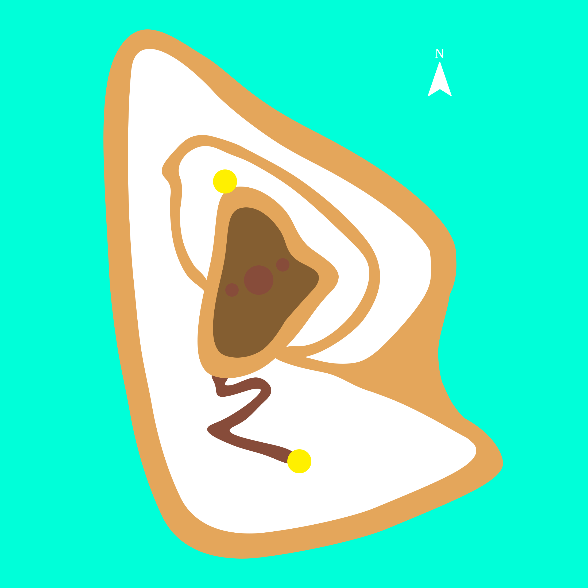
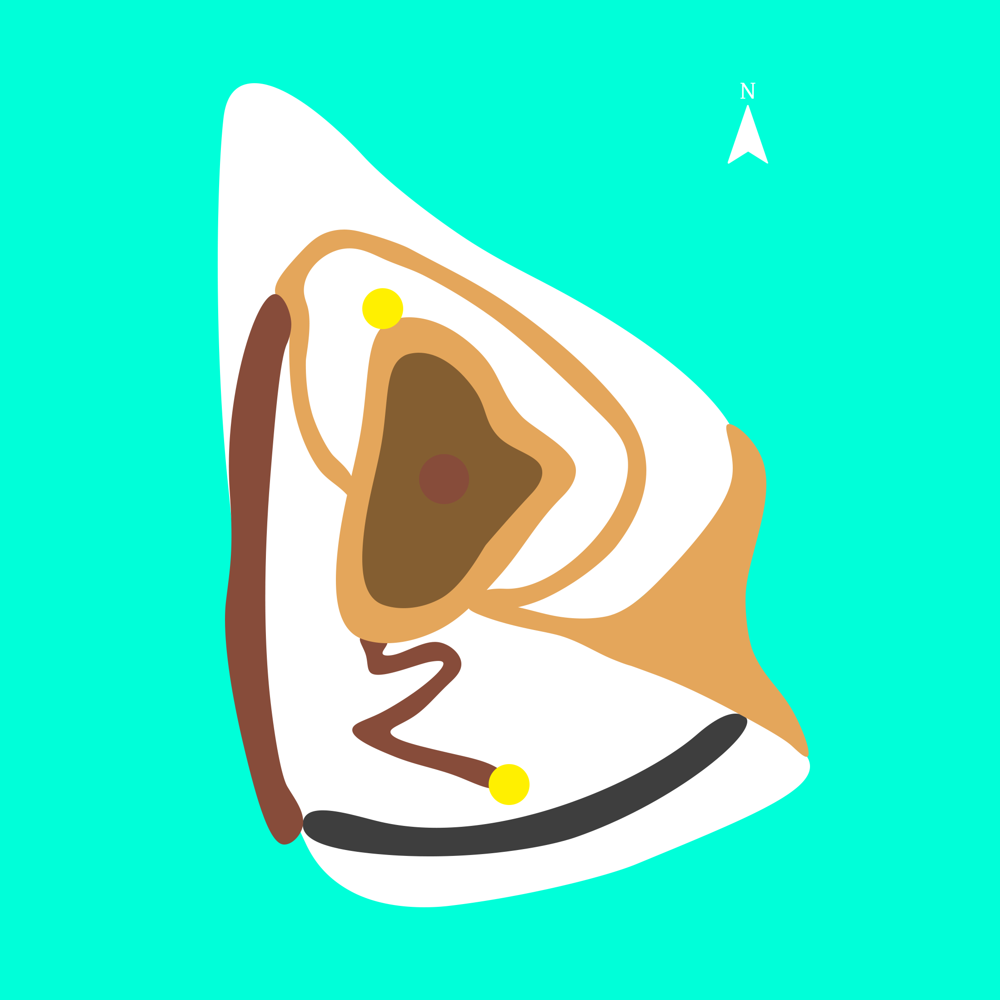

**Ch-ch-ch-ch-changes (and additions)** ➕

Below is the original layout of the island that I created when I switched to Unreal.

In this version, the island is encircled by a beach, which the player is able to walk on, giving them the possibility to walk all around the island. Collectibles can spawn here as well, which turned out to be a bit of an issue: While the elevated ring path around the swamp and the hillside outlook allow the player to overlook the eastern, northern, and northwestern parts of the beach, this is not the case for the southern and southwestern parts. Furthermore, if the player wanted to get to an elevated position to look for the next collectible, there is only one access point to the inner part of the island, which is at the intersection between the beach, elevated path, and swamp. Testing the game, I realized this led a lot of walking, especially when circling the island via the beach, only to find the next collectible elsewhere.

Addressing these issues, I massively reduced the size of the beach, with only a relatively small patch left in the east of the island. I then added two new areas in the south and west that connect the beach to the elevated pathway. The new area in the south is a cave that can be accessed from the beach and leads to the new area in the west, a rocky path along the ocean.

Adding a cave provided a good opportunity for having a new type of environment that contrasts the outer areas. A cave provides opportunity to implement a noticeable reverb, affecting sounds and music. I have also scattered colorful lights around it, that I plan to synchronize with the music.

**Playing with acoustics** 👂

- Check Microsoft Acoustics and microphone support ✅

**Footsteps** 👣
- Implement footstep sounds ✅

- Connect environmental sounds with music system ✅

- More musical frogs/swamp ✅
I remade the frog sounds in the swamp, since the pitch of their calls was not clear enough to connect with the music. I took a different kind of frog sound as inspiration:

Then, I recreated it. Because I could achieve a result that resembled the inspiration closely just by  using synthesized sounds, no samples were used here:

- Add day/night cycle ✅
- Add more things that happen when player collects stones ✅