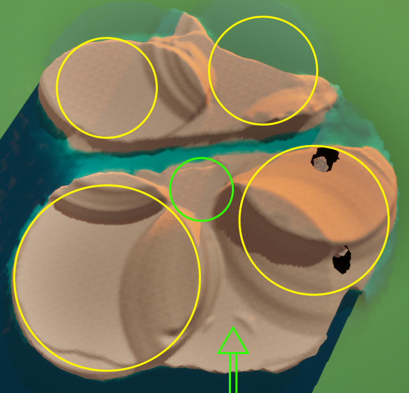

[Back to main](index.html)

**New worlds** 🏝️

I have begun work on island 2, which hosts the sound-led game mechanics. To create the new island, I followed a similar approach as with island 1. First, I sculpted the landscape.

Using the landscape tool, I created a rough sectioning of the island, to provide dedicated areas for the various sound-led game mechanics I aim to implement. The steep inclines act as separators, with the intention of focusing the player's view on their current area and minimizing distractions by other areas. At the same time, I'm leaving just enough gaps for players to catch a glimpse of other areas and possibly incite curiosity. Nevertheless, on this island it's especially important for the player to be able to maintain focus, since some of the sound-led interactions require a deep engagement with sound.

The yellow circles in the picture above show where I currently aim to implement gameplay areas. The green circle in the middle marks a hub location, from which the player will be able to reach all other areas. The green arrow in the bottom indicates where the player enters the island. I also made a cut that separates the island into two parts. The reason behind this is that I intend to have the player cross this small ravine by interacting with a sound-led game mechanic. Most likely, I will implement the rhythm grid here, to have the player traverse the grid and get to the other side.

I decided to first implement the wind path game mechanic on this island, for which I designated the circled area in the bottom right. Since I wanted this mechanic to play out in a dark location, I created a cave tunnel underneath the hill there. The dark spots within that circle mark both ends of the tunnel. Before sending the player into a pitch black cave, however, I wanted to give them some time to learn the mechanic of having to listen to the wind for navigation. For this purpose, I built a small outdoor labyrinth that leads to the cave. More on that later.

To add more definition to the shape of the island, I began dressing it up with rock geometry. Just like on the first island, I used a single rock 3D model, copied, rotated, and scaled many times to avoid repetition, while keeping the project size small, using a minimal amount of objects. I did, however, use a different rock model than on island 1, which should help maintain a consistent, yet distinct look for each area in Soundgarden.

On the first island, whenever it gets dark, a light orb appears that follows the player and lights the way. Since this might interfere with the game mechanics of island 2, for example, by lighting the otherwise pitch black wind cave, the light orb will be disabled here. Instead, I have place some lights around the island that will ensure the player can navigate regardless of daylight.

I then proceeded to connect the two islands. At first, I implemented a walkway that would appear after the player completes the tutorial on island 1. However, I noticed that walking between the islands might be a little boring, since there's nothing else to do here. Therefore, I removed the walkway and added teleporters that transport the player between islands. With this in mind, I am already rethinking my concept for island 3, which will be the subject of the next phase of this project.

Since I would still prefer players to walk between the islands, I am considering to make island 3 a lagoon instead. The lagoon would be placed in between the two islands, allowing the player to move between them and would hold a variety of mechanics where the player can affect and change sounds. Come to think of it, I actually don't remember having seen many lagoons as game environments, so this would be an interesting concept to work with overall. Perhaps, the novelty factor of a lagoon would support the experimental nature of the upcoming interactions with sound.

**Final ruminations on wind** 🌬️

Since the playtest was pushed back by another week, I used the extra time to integrate the wind path mechanic into the new island, as described above. This allowed testers to test it out in a natural environment, as opposed to a grey box level.

As mentioned above, the outdoor labyrinth area is meant to teach the wind path mechanic. The area features some dead ends. However, if the player follows the sound of the wind, they will eventually arrive at the cave entrance. While testers noticed the howling of the wind and enjoyed how it sounded, some did not recognize that the sound was there to guide them, and those who did, did not know how to interpret the sonic information. This means I need to add more guidance here. [Just like I did with the illustration on island 1 that indicates to players to collect rocks](2024-03-13.md), I need to think of a fitting pictographic depiction of "you must listen to the sound and follow its direction", preferably in the same archaic style as before to remain stylistically consistent. Since the labyrinth is not too complex, players would still be able to find the cave entrance. However, the issue became even more apparent once players entered the dark cave. Without knowledge of how to interpret the sound, none of the testers actually managed to get to the other end.

I clarified the function and meaning of the sound, explaining how each of the two types of wind sounds indicate the direction of the respective cave ends. However, even with this knowledge, testers reported having difficulties in differentiating between the two sounds, which likely interfered with locating the direction of the wind sound leading to the desired exit. I tried to address the issue by having only the wind sound leading to the opposite exit be audible when entering through the wind path, gradually fading in the second wind sound leading back to where the player got in. I hoped that this would help players "lock on" to one of the sounds. However, this was still not clear enough. I also realized that it may actually be more difficult to follow a sound in a straight line ahead than turning around corners, since sounds coming more from the left or right are just more noticeable.

There are several ways I could address these issues. First, I could focus more on teaching the mechanic. Since I was able to navigate the cave without issues, I know it is absolutely possible to traverse it by ear. Therefore, taking more time to thoroughly teach this mechanic to the player might help. Second, I could add some tonality to the wind sounds, in the same way I did with the beach sound of island 1. Each of the two wind sounds could additionally incorporate a musical pitch that would likely help in differentiating between them. Perhaps this will also mitigate the issue occurring in straight sections. Third, I'm thinking back about my concepts for facilitating a feeling of embodiment. [In a previous post](2024-04-16.md), I briefly mentioned the idea of having the player character's body brushing over surrounding surfaces. This could actually come handy in here, since players would have a way of locating walls by brushing against them. Using this additional information in conjunction with the wind sounds might make it easier to navigate the darkness.

Aside from this feedback, testers also noted the good graphics and the soothing atmosphere and sounds of Soundgarden. They also commended how the composition of the landscape guides the players gaze and creates focus. Since I never aimed for good graphics, I think it's funny that my game about sound was noticed for that. However, in terms of the environmental design, I'm glad to know I'm on the right track here.

**What's next?** 💭

I still need to re-implement the rhythm grid from its grey box version to something that integrates nicely with island 2's environment. Instead of using transparent platforms, I might end up going for something more kinetic. Perhaps rock platforms that slide in/out in the rhythm.
I'm also thinking about the next sound-led interaction to prototype. For that, I'm going to have another look at the listening mode-based mechanics I outlined [in my previous post](2024-12-16.md).